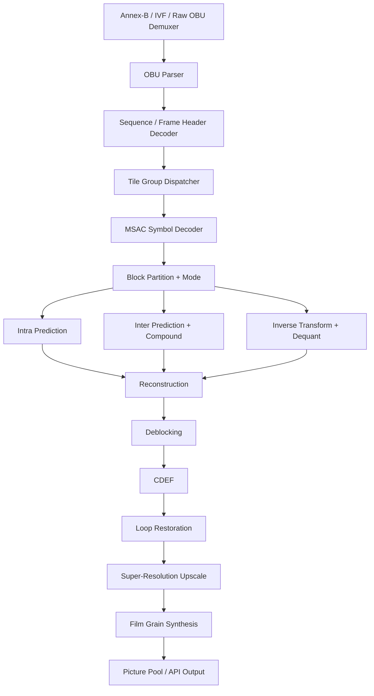

# go-av1 Design

This document captures the architecture of `go-av1`, a pure-Go AV1 codec.
It is intentionally written before any algorithm is implemented so that all
later milestones share a single mental model.

The decoder is the primary first-phase artefact. The encoder phase is sketched
at the end of the document for forward compatibility.

## 1. Background and scope

| Aspect           | Phase 1 (decoder)                              | Phase 2 (encoder)              |
|------------------|------------------------------------------------|--------------------------------|
| Profile          | 0 (Main)                                       | 0 (Main)                       |
| Bit depth        | 8                                              | 8                              |
| Chroma           | 4:2:0                                          | 4:2:0                          |
| Frame types      | Key, Inter, Switch, Intra-only, Show-existing  | Key, Inter (low-complexity)    |
| Tools required   | All Profile 0 tools, incl. CDEF / LR / FG / SR | Subset, expand over milestones |
| Reference impl.  | dav1d                                          | SVT-AV1                        |

Out of scope for the first release: 10/12-bit decoding, 4:2:2 / 4:4:4 chroma,
hardware acceleration backends, AV1 large-scale tile mode tooling.

## 2. Architecture



The pipeline mirrors dav1d: parsing, decoding, post-filtering, and output run
as separable stages so they can be parallelised at the frame, tile, and row
granularities (M7).

### 2.1 Module map (Go package ↔ dav1d source)

| go-av1 package                | dav1d reference                                                 |
|-------------------------------|-----------------------------------------------------------------|
| `internal/bitstream`          | `src/getbits.{c,h}`, `src/msac.{c,h}`                           |
| `internal/obu`                | `src/obu.{c,h}`                                                 |
| `internal/header`             | structs from `include/dav1d/headers.h`, `src/levels.h`          |
| `internal/tile`               | tile parsing in `src/decode.c`                                  |
| `internal/transform`          | `src/itx.h`, `src/itx_1d.{c,h}`, `src/itx_tmpl.c`               |
| `internal/predict/intra`      | `src/ipred.h`, `src/ipred_prepare_tmpl.c`, `src/ipred_tmpl.c`   |
| `internal/predict/inter`      | `src/mc.{h,c}` (`mc_tmpl.c`), `src/warpmv.{c,h}`                |
| `internal/refmvs`             | `src/refmvs.{c,h}`                                              |
| `internal/loopfilter`         | `src/loopfilter.h`, `src/loopfilter_tmpl.c`, `src/lf_*.c`       |
| `internal/cdef`               | `src/cdef.h`, `src/cdef_tmpl.c`, `src/cdef_apply_tmpl.c`        |
| `internal/looprestoration`    | `src/looprestoration.h`, `src/looprestoration_tmpl.c`, `lr_*.c` |
| `internal/filmgrain`          | `src/filmgrain.h`, `src/filmgrain_tmpl.c`, `src/fg_apply_tmpl.c`|
| `internal/picture`            | `src/picture.{c,h}`, `src/ref.{c,h}`                            |
| `internal/dispatch`           | `src/cpu.{c,h}` and the per-arch dispatchers                    |

### 2.2 Public API (`pkg/av1`)

The public API mirrors the streaming model of `Dav1dContext` and is wrapped by
idiomatic Go conveniences.

```go
// Streaming (1:1 with dav1d):
dec, err := av1.NewDecoder(av1.DecoderOptions{Threads: 0})
defer dec.Close()
err = dec.SendData(packet)        // returns ErrAgain when full
pic, err := dec.GetPicture()      // returns ErrAgain when more data is needed
```

A higher-level helper sits on top:

```go
// Convenience helper. Reads OBUs from r and yields decoded pictures.
for pic, err := range av1.DecodeReader(r) {
    if err != nil { ... }
    use(pic)
}
```

The decoder never allocates a new `Picture` in its hot path; each `Picture` is
borrowed from a pool and released by `pic.Release()` when the caller is done.

### 2.3 Error model

`pkg/av1` exposes sentinel errors mirroring dav1d's `errno` convention:

| Sentinel              | dav1d analogue        | Meaning                                |
|-----------------------|-----------------------|----------------------------------------|
| `ErrAgain`            | `EAGAIN`              | More data needed / output not ready.   |
| `ErrInvalidBitstream` | `EINVAL`              | Bitstream violates AV1 conformance.    |
| `ErrUnsupported`      | `ENOTSUP`             | Feature not yet implemented in go-av1. |
| `ErrClosed`           | `EBADF`               | Use of a decoder after `Close`.        |
| `ErrNotImplemented`   | scaffold-only         | Returned by every M0 stub.             |

Wrapping uses `fmt.Errorf("...: %w", ErrInvalidBitstream)`. Callers use
`errors.Is`.

## 3. Concurrency model

dav1d separates parsing, tile decoding, and post-filter passes into
fine-grained tasks that ride on top of the OS thread pool. `go-av1` reuses the
shape but runs on goroutines:

| Stage          | Default concurrency  | Notes                                                           |
|----------------|----------------------|-----------------------------------------------------------------|
| Demuxer / OBU  | 1                    | Cheap, sequential.                                              |
| Frame parse    | 1 per in-flight frame| Up to `MaxFrameDelay`.                                          |
| Tile decode    | `Threads` workers    | Workstealing channel; tiles are independent within a frame.     |
| Post-filters   | row-based            | Deblock / CDEF / LR pipelined per superblock row, like dav1d.   |
| Film grain     | per output frame     | Cheap; runs on the output goroutine.                            |

Backpressure follows dav1d:
- `SendData` returns `ErrAgain` when the parser queue is full.
- `GetPicture` returns `ErrAgain` when no completed frame is available yet.

The mapping to dav1d source: `src/thread_task.c` (task graph) and
`src/internal.h` (`Dav1dFrameContext`, `Dav1dTileState`). The Go equivalents
live in `internal/tile` and a yet-to-be-created `internal/scheduler` (post-M3).

## 4. Memory model

- Plane buffers live in `internal/picture.Pool`. Each plane is a single
  `[]byte`; rows are stride-aligned to 64 bytes so future SIMD loads can be
  unaligned-free.
- Reference counting is done with `atomic.Int32`. A picture is recycled when
  the count drops to zero. Callers obtain a count by `Picture.Retain()` and
  release with `Picture.Release()`.
- Per-frame scratch state (transform coefficient buffers, MV grids, partition
  trees) is owned by a `FrameContext` reused across frames via `sync.Pool`.
- No allocations inside `tileDecodeRow`; everything is taken from arena slabs.
  This is the same pattern dav1d uses with the `Dav1dFrameContext` arenas.

## 5. Bitstream layer

`internal/bitstream` exposes two readers:

```go
// Plain bit reader for fixed-width syntax elements (uvlc, ns, le, etc.).
type BitReader struct { ... }
func (r *BitReader) F(n uint) uint32
func (r *BitReader) UVLC() uint32
func (r *BitReader) Leb128() uint64

// Multi-symbol arithmetic decoder.
type MSAC struct { ... }
func (m *MSAC) Bool(f int) int
func (m *MSAC) Symbol(cdf []uint16, n int) int
func (m *MSAC) SymbolAdapt(cdf []uint16, n int) int
```

Both are deliberately allocation-free, lifted from dav1d `getbits.c` and
`msac.c`. M1 contains a fuzz harness (`go test -fuzz`) seeded with dav1d's
`tests/header_fuzzer.c` corpus.

## 6. Dispatch layer

```go
package dispatch

type CPUFeatures struct {
    AVX2, AVX512, NEON, SVE, SVE2 bool
}

func Detect() CPUFeatures
func ForceGeneric()  // for tests
```

Kernel tables are one-per-domain. Example:

```go
package transform

type ItxKernel func(dst []int16, dstStride int, coef []int16, eob int)

type Kernels struct {
    Itx [TxSizes][TxTypes]ItxKernel
}

var generic Kernels // pure-Go reference
var current  Kernels // selected at init based on dispatch.Detect()
```

This makes the M9 SIMD work additive: each kernel gets a Plan 9 assembly file
under a build tag like `//go:build amd64 && !purego` and registers itself via
an `init()` hook. The pure-Go implementation always remains the source of
truth for tests.

## 7. Testing strategy

| Layer        | Tooling                                                         |
|--------------|-----------------------------------------------------------------|
| Unit         | `go test`, table-driven, generic kernels vs reference vectors.  |
| Differential | Run dav1d binary side-by-side; compare YUV byte for byte.       |
| Conformance  | AOM `av1-test-vectors` + dav1d `tests/dav1d-test-data`.         |
| Fuzz         | `go test -fuzz` on `internal/bitstream` and `internal/obu`.     |
| Bench        | `go test -bench` per kernel; reports against dav1d as baseline. |

`test/conformance/README.md` describes how to fetch the vectors, since they are
too large to vendor.

## 8. Logging and observability

A minimal `Logger` interface lets callers wire `slog`. Internally we keep a
`debug.Tracef` zero-cost-when-disabled function (a `bool` build tag plus an
empty function body) so per-block prints can be added during M3/M4 without
hurting release performance.

## 9. Encoder phase outline

The encoder is reserved for M10+. It is sketched here so the decoder packages
do not paint it into a corner.

| go-av1 package                | SVT-AV1 reference (`Source/Lib/Codec`)                    |
|-------------------------------|-----------------------------------------------------------|
| `internal/encoder/obuwriter`  | bitstream writers, tile group packing                     |
| `internal/encoder/ratecontrol`| `EbRateControl*.c`                                        |
| `internal/encoder/me`         | motion estimation (`EbMotionEstimation*.c`)               |
| `internal/encoder/md`         | mode decision (`EbModeDecision*.c`)                       |
| `internal/encoder/tx`         | forward transform / quantisation                          |
| `internal/encoder/loop`       | encoder-side deblock / CDEF / LR optimisation             |
| `internal/encoder/entropy`    | symbol coder + CDF update                                 |
| `internal/encoder/tpl`        | temporal dependency model (after-M13)                     |

The encoder reuses `internal/picture`, `internal/bitstream` (writer side),
`internal/transform`, `internal/predict`, and the dispatch tables.

## 10. Open decisions

- Final module path. Set to `github.com/zesun96/go-av1`. The repository is
  hosted at <https://github.com/zesun96/go-av1>.
- CI provider. The skeleton uses plain `go` commands only; CI YAML lands when
  M1 introduces the first executable test.
- Whether to add a `purego` build tag to permanently disable assembly paths.
  Tentative: yes, mirroring `golang.org/x/sys/cpu`.
